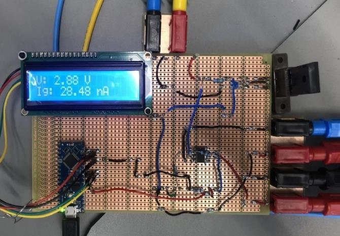

# MOSFET Gate Leakage Current Measurement

An undergraduate electronics project to design and test a circuit for measuring nanoamp-scale gate leakage current in power MOSFETs. Completed as an ES327 technical report at the University of Warwick.

## Project overview

Gate leakage current can provide information about a MOSFET's gate insulation. Measuring it is challenging because the current is very small. This project developed a measurement path using a high-value shunt resistor, an op-amp sensor stage and an Arduino for voltage acquisition and display.

The final setup used a gain-11 amplifier, a 10 MΩ shunt resistor, an Arduino Nano Every and an LCD. The full design and experimental method are described in the report.

## Hardware

<p align="center">
  
</p>


## Development

The work progressed from initial direct measurement attempts to a conditioned sensor circuit:

1. Investigated direct measurement of MOSFET leakage current.
2. Built and tested an op-amp sensor, first at unity gain and then at a gain of 11.
3. Integrated Arduino voltage acquisition and LCD output.
4. Designed a transistor holder and assembled the final circuit.
5. Tested the system using four MOSFETs.

## Results

The report records the following measured gate leakage currents:

| MOSFET | Measured gate leakage current | Reported uncertainty |
|---|---:|---:|
| IRL530 | 1.069 nA | 4.85% |
| NXP OP629 | 2.035 nA | 8.84% |
| CREE C3M0280090W | 28.73 nA | 15.18% |
| CREE C3M0280090W | 3.45 nA | 21.42% |

The two CREE devices showed different readings, and the report discusses one as having a faulty gate. The report also notes measurement noise and relatively high uncertainty for the final two readings, so the results should be read with those limitations in mind.

## Technology and methods

- Analog electronics and op-amp signal conditioning
- Power MOSFETs and leakage-current measurement
- Arduino Nano Every and LCD integration
- Breadboard/prototyping-board construction
- Experimental testing and uncertainty analysis

## Report

See [`report/ES327_Technical_Report.pdf`](report/ES327_Technical_Report.pdf) for the full report. This repository includes a public copy with the student ID and email removed from the cover page. No separate Arduino source file was available; the report includes the relevant code excerpt.

## Repository contents

```text
report/   Redacted technical report PDF
images/   Selected project photographs from the report
```
